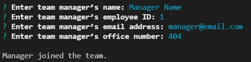
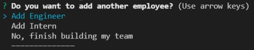
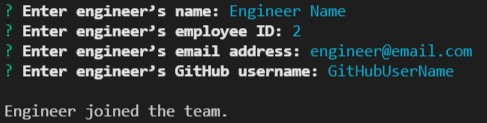
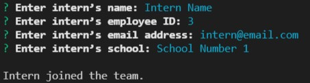
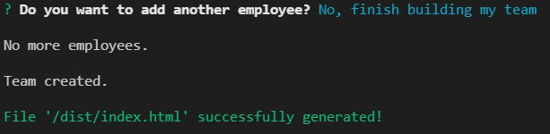
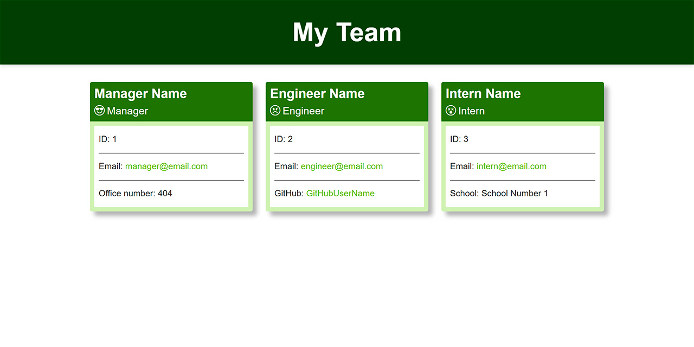

# Team Profile Generator

## Description
A command-line application that prompts user for information about team members and then generates a [HTML file](./dist/index.html) with summaries for each member of the team. The application allows to add team's manager and any number of engineers and interns.

## Table of Contents
- [Installation](#installation)
- [Usage](#usage)
- [Credits](#credits)
- [Tests](#tests)

## Installation
To be able to use the script to generate [HTML file of you team](./dist/index.html), you need to install the necessary `npm modules`. You can do this by running the command 

```bash
npm install
```

in the root folder of the project.

## Usage
To run script for generation [HTML file](./dist/index.html) use this command

```bash
npm start
```

After running the script, you need to fill in information about team member.

First, fill in information about team's manager:



After add manager's information, you can add another team members or finish building a team:



Engineer information:



Intern information:



After finishing building a team, application generated a [HTML file](./dist/index.html):



HTML File Preview image:



Watch a [Video Guide](https://drive.google.com/file/d/1piV_5XtBwXstEf6iUU58kIOmsyhAWPSH/view) for more details.

## Credits
Author [Oleksandr Kulyk](https://github.com/AlexKuWerz)

Packages used:
- [Inquirer](https://www.npmjs.com/package/inquirer)
- [Jest](https://www.npmjs.com/package/jest)

## Tests
The application uses [Jest package](https://www.npmjs.com/package/jest) for running the unit tests.

To run test scripts use this command:

```bash
npm test
```
> Note: **NOT** 100% coverage
